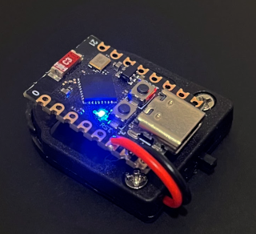
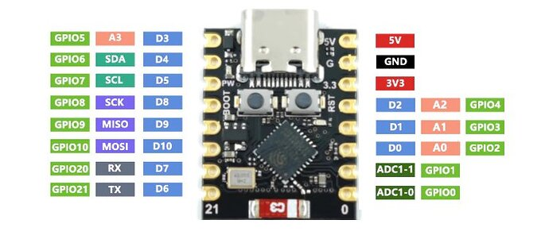
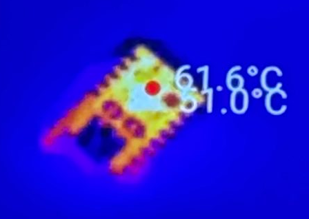

# ESP32-C3 SSID / Access Point Spammer

## What is it?
It is a battery powered, very fast, and very small mini ESP32-C3 based SSID Access Point spammer. It generates hundreds of phantom access points with random strings within seconds of being turned on.

This is intended for pentesters and security researchers. **Use at your own risk where you have permission to do such things.**

This code came from muliple other projects and has been modified endlessly for pentests, pranks, and tests. It needs tidying up and I need to find the orignal author to credit.

The code does not actually create access points, it spams out packets advertising access points that do not exist. This makes it super fast. So many access points are created so quickly that different devices will see different access points adding to the confusion.

**Runtime.** The devices runs for over an hour on a single charge. If you need longer, you could use an alternative battery pack or simply avoid any assembly and just power the board from any USB power bank.

**Range.** The effective range of this device seems to be up to 10 meters. There are of course other boards with external antennas and ways of attaching antennas which will increate the range.

**Regional Restrictions.** This code uses all the WiFi channels and maxes the power, please check you are within the legal ranges for where you are.

## Why?
* To test your Wireless Intrusion Protection System (it should light up like a christmas tree)
* To obscure other WiFi access points, by burying the real SSID under hundreds of fake ones.
* To delay someone from connecting to a new WiFi access point, by making the correct WiFi hard to find.
* To poison SSID geo location data, by feeding war drivers with false information.
* To distract SOC teams and/or physical security teams.

## Parts needed
### ESP32 Board
Almost any ESP32 development board will do, but I used an ESP32C3 Supermini.

### Battery Holder
This project uses a single CR2032 battery holder with on/off switch to match the size of the device. I dont have a part number for these, but any electronics supplier should have them, there are plenty on eBay and amazon.

### Battery
LIR2032 coin battery.
The standard CR2032 battery only supplies 3 volts which is not enough to power the ESP32C3 board. LIR2032 batteries are rechargleable and supply up to 3.7 volts.

## Assembly

* Cut the wires on the coin battery holder to a suitable length (~3cm) and strip the ends.
* Solder the black cable to ground pin labeled G (GND on the diagram)
* Solder the red cable to the pin labeled 3.3 (3V£ on the diagram)
* Flash the board with the Arduino code. (Board type is AirM2M_CORE_ESP32C3)
* Turn it on and check your WiFi.
The device can be powered by the coin battery or usb.

## Warning
**This thing gets hot!**

At 60 degrees this this becomes hot to touch within a few seconds. This is normal for this board.

## What Else?
Of course this is just as ESP32 so you could run anything else you want on this board: evil twin APs, deauth attacks, probe scanning, and any other esp32_marauder attack you can think of.
